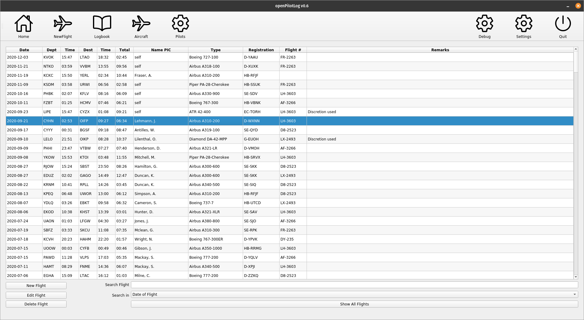
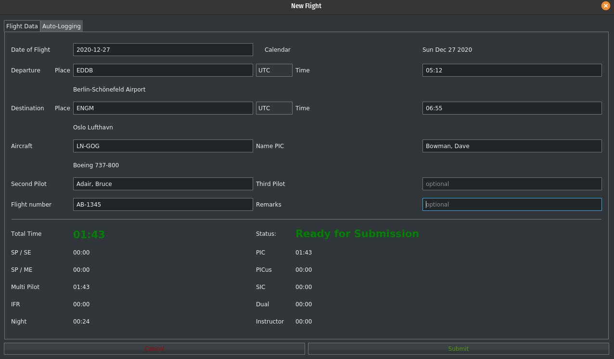
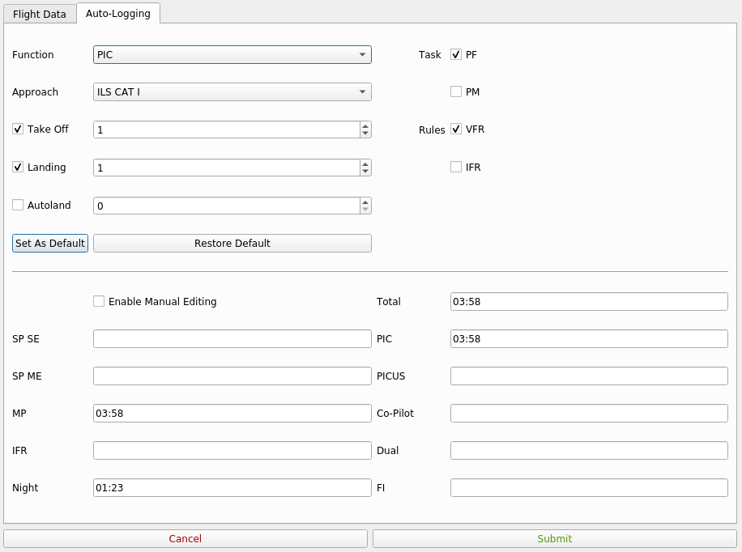
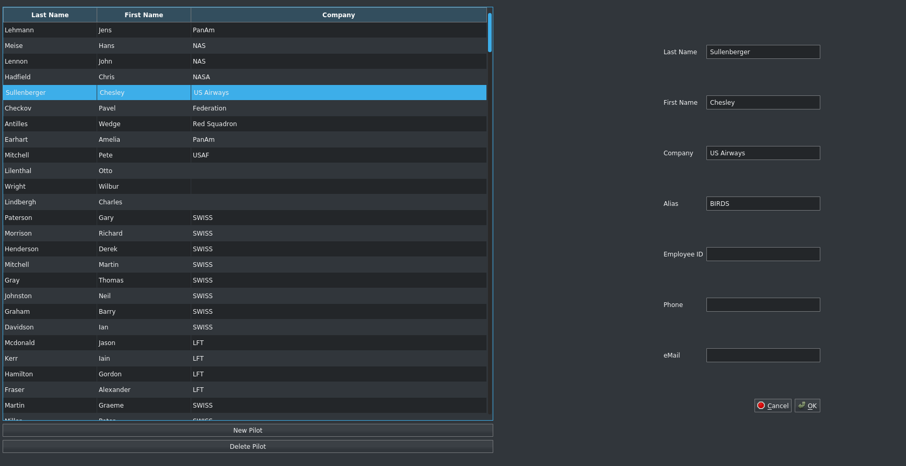

# openPilotLog

Welcome to openPilotLog, the free and open source airline pilot logbook application!

## Tl;dr

Airline pilots are required to maintain a logbook containing details of their flights. These logbooks were historically written by hand on paper, but of course nowadays more and more people are doing it electronically, be it in their own excel sheet or using a paid logbook software.

I have used paid solutions for many years, and have seen more and of them move from being a one-time license purchase to becoming a "Logbook as a Service" type subscription. After the one I have been using for the last couple of years, and had bought a "lifetime license" for ended up announcing they also moved to a subscription based service, I decided that it is time for a free and open source alternative that is fast, easy to use, and does not require a subscription.

## The state of the project!

openPilotLog is currently in development, so no release is provided yet. If you would like to be informed about upcoming releases, you can [subscribe](https://openpilotlog.eu/?page_id=48) to our newsletter.

If you want to learn more about this project, check out the [wiki](https://github.com/fiffty-50/openpilotlog/wiki) or the [blog](https://openpilotlog.eu/?page_id=35)!

For developers, the code documentation can be found at our [doxygen](https://fiffty-50.github.io/openPilotLog/html/index.html) pages. If you are interested in contributing to the project, you can get in touch [here](mailto:felix.turo@gmail.com?subject=[GitHub]%20Contributing%20to%20openPilotLog).

# How does it look like?

Here are some early screenshots:

