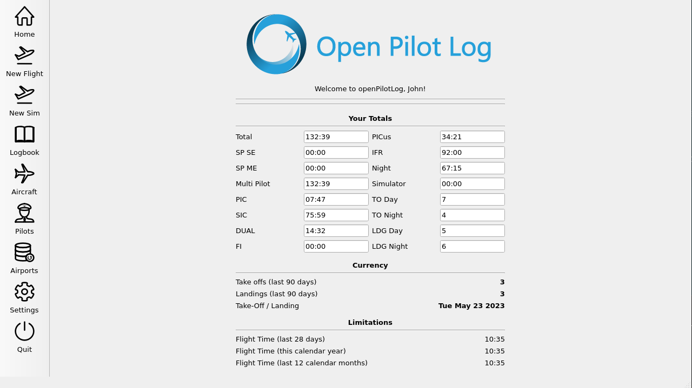
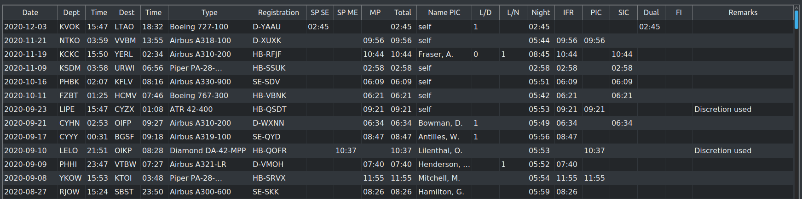

# openPilotLog

Welcome to openPilotLog, the free and open source airline pilot logbook application! You can find the latest release [here](https://github.com/fiffty-50/openPilotLog/releases). Please not that this is still an early testing version.

## Tl;dr

Airline pilots are required to maintain a logbook containing details of their flights. These logbooks were historically written by hand on paper, but of course nowadays more and more people are doing it electronically, be it in their own excel sheet or using a paid logbook software.

I have used paid solutions for many years, and have seen more and of them move from being a one-time license purchase to becoming a "Logbook as a Service" type subscription. After the one I have been using for the last couple of years, and had bought a "lifetime license" for ended up announcing they also moved to a subscription based service, I decided that it is time for a free and open source alternative that is fast, easy to use, and does not require a subscription.

## How does it look like?

Here are some screenshots:





## The state of the project!

openPilotLog is currently in development, it is not recommended to use it as your primary logbook solution just yet. If you would like to be informed about upcoming stable releases, you can [subscribe](https://openpilotlog.eu/?page_id=48) to our newsletter.

If you want to learn more about this project, check out the [wiki](https://github.com/fiffty-50/openpilotlog/wiki) or the [blog](https://openpilotlog.eu/?page_id=35)!

For developers, the code documentation can be found at our [doxygen](https://fiffty-50.github.io/openPilotLog/html/index.html) pages. If you are interested in contributing to the project, you can get in touch [here](mailto:felix.turo@gmail.com?subject=[GitHub]%20Contributing%20to%20openPilotLog).

## Installation

Right now, there are only [testing versions](https://github.com/fiffty-50/openPilotLog/releases) available, so I have not created installers for them. Since this version is aimed at early testers and advanced users, some manual steps may be required to install openPilotLog.

### Windows
Download and install the [release](https://github.com/fiffty-50/openPilotLog/releases/download/beta/openPilotLog_v0_1_windows_x64.zip) and unzip it to a destination folder of your liking.
### macOS
Download and open the .dmg file for your configuration ([arm64](https://github.com/fiffty-50/openPilotLog/releases/download/beta/openPilotLog_0_1_macOS_arm64.dmg) - M1/M2 based machines, [x86_64](https://github.com/fiffty-50/openPilotLog/releases/download/beta/openPilotLog_0_1_macOS_x86_64.dmg) - Intel based).
### Linux - using flatpak
Make sure you have [flatpak](https://flatpak.org/setup/) installed and working. Then download the [release](https://github.com/fiffty-50/openPilotLog/releases/download/beta/openPilotLog_0_1_linux_x86_64.flatpak) and install the package.

```bash
# Requires kde platform runtime version `5.15-21.08`.
flatpak install org.kde.Platform 
flatpak install --user [PathToDownloadedPackage].flatpak

# Then run the program with
flatpak run org.opl.openPilotLog
```
### Linux - build latest from source
If you want to build the project from source you can use cmake-ninja, Qt Creator flatpak-builder (see `yaml` file located [here](docs/deployment/linux-flatpak/org.opl.openPilotLog.yaml)). You can find more information in the [deployment docs](docs/deployment/linux-flatpak/flatpak_creation.md)

